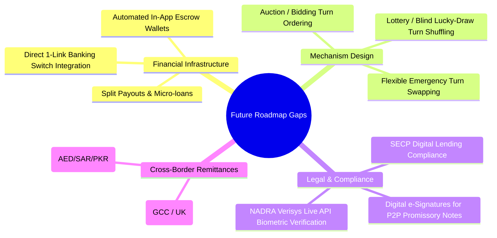
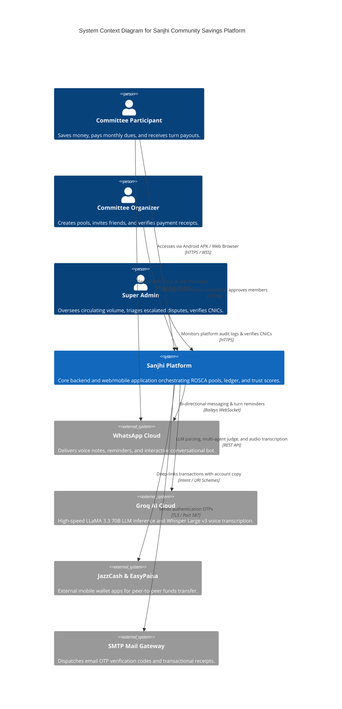
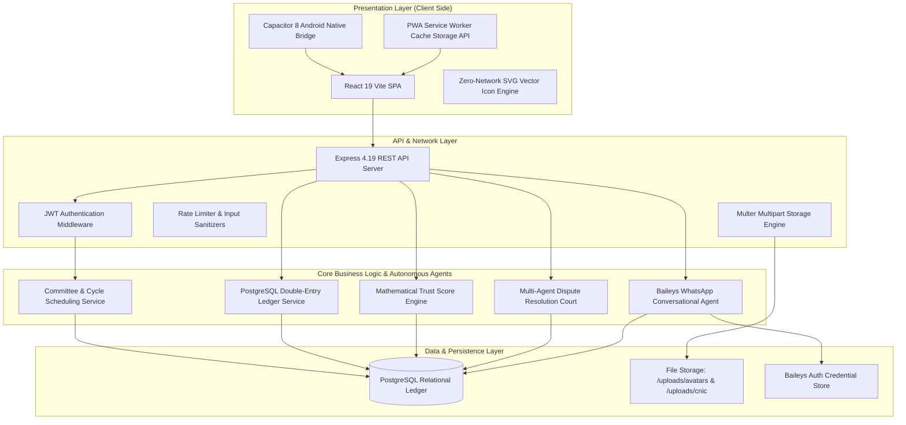
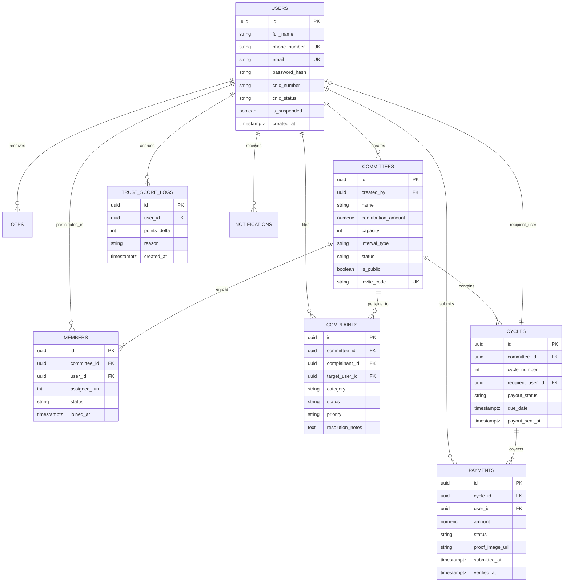
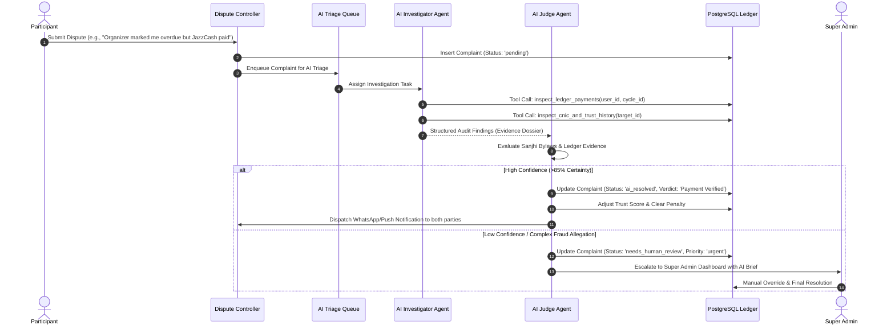
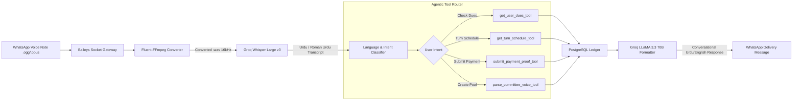
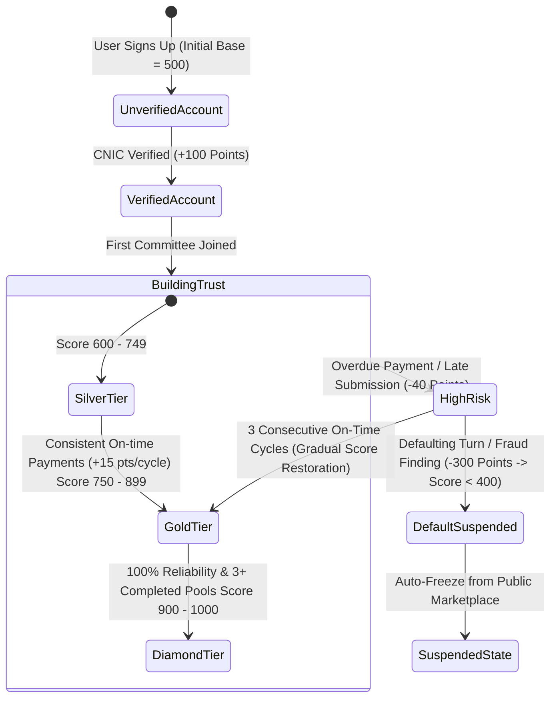
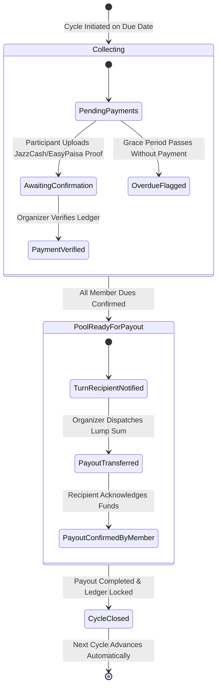
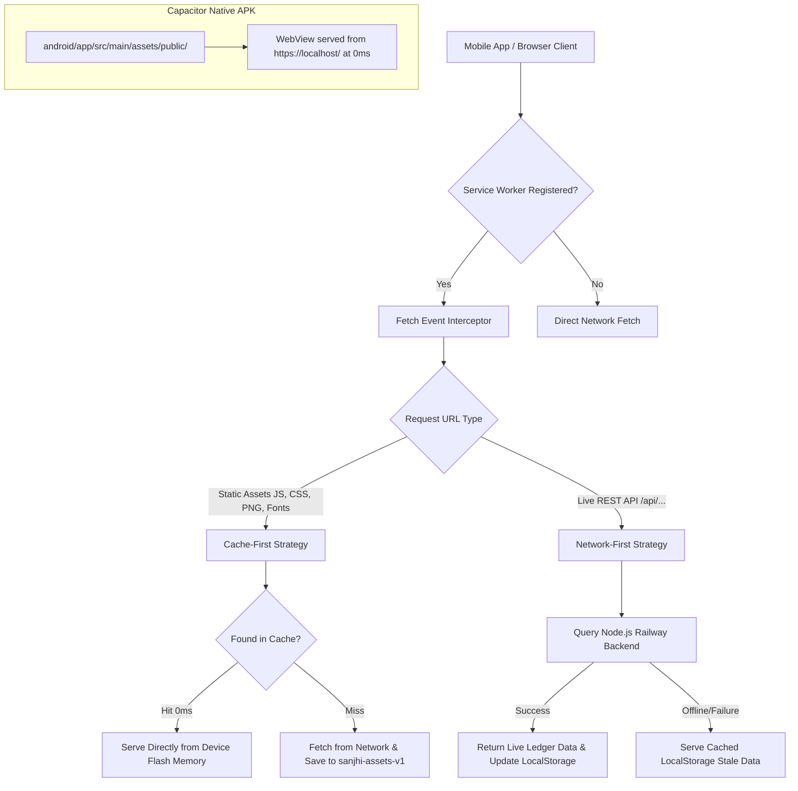

# 🏛️ Sanjhi (سانجھی) — SRS Gap Analysis & Complete System Architecture

> **Document Version:** 2.0  
> **Status:** Comprehensive Technical Design & Requirements Audit  
> **Target Platform:** Web (React 19 / PWA), Native Mobile (Capacitor Android APK), WhatsApp Conversational AI (Baileys)

---

## 📑 Table of Contents
1. [Executive Summary & SRS Alignment Overview](#1-executive-summary--srs-alignment-overview)
2. [SRS Feature Comparison & Gap Matrix](#2-srs-feature-comparison--gap-matrix)
3. [Features Implemented Beyond Original SRS Specifications](#3-features-implemented-beyond-original-srs-specifications)
4. [Missing / Future Scope Features](#4-missing--future-scope-features)
5. [Comprehensive System Architecture Diagrams](#5-comprehensive-system-architecture-diagrams)
   * [5.1 High-Level C4 System Context Diagram](#51-high-level-c4-system-context-diagram)
   * [5.2 Layered Modular Software Architecture](#52-layered-modular-software-architecture)
   * [5.3 Database Entity-Relationship Diagram (ERD)](#53-database-entity-relationship-diagram-erd)
   * [5.4 Autonomous Multi-Agent AI Dispute Resolution Court](#54-autonomous-multi-agent-ai-dispute-resolution-court)
   * [5.5 Multilingual WhatsApp Voice & Text Processing Pipeline](#55-multilingual-whatsapp-voice--text-processing-pipeline)
   * [5.6 Mathematical Trust Scoring (0–1000) State Machine](#56-mathematical-trust-scoring-01000-state-machine)
   * [5.7 Financial Cycle & Turn Payout State Transition](#57-financial-cycle--turn-payout-state-transition)
   * [5.8 Zero-Latency Mobile Storage & Service Worker Cache Engine](#58-zero-latency-mobile-storage--service-worker-cache-engine)

---

## 1. Executive Summary & SRS Alignment Overview

The original **Software Requirements Specification (SRS)** established the functional baseline for digitizing traditional South Asian Rotating Savings and Credit Associations (**ROSCAs** / **Kameti / کمیٹی**). 

While the initial SRS focused primarily on basic CRUD committee creation, manual payment tracking, and static roles, the **actual production implementation of Sanjhi** has evolved into a resilient financial platform featuring:
* **Multi-Agent Autonomous AI Dispute Triage** (Investigator Agent + Judge Agent with zero-hallucination tools).
* **Bilingual WhatsApp Voice Note Processing** in Roman Urdu and Urdu script using Groq Whisper Large v3 and LLaMA 3.3 70B.
* **Dual Pakistani Mobile Wallet Deep-Linking** (JazzCash and EasyPaisa).
* **0ms Zero-Latency Offline-First Caching Architecture** (PWA Service Worker + Capacitor Native Android APK).

---

## 2. SRS Feature Comparison & Gap Matrix

| Functional Module | Baseline SRS Requirement | Actual Implemented State | SRS Gap / Extension Status |
| :--- | :--- | :--- | :--- |
| **Authentication (FR-AUTH)** | OTP-only mobile login | Dual phone/email auth + 6-digit BCrypt hashed OTP + Contact linking | **Exceeds SRS** (Supports secondary email/phone additions with 2-step verification) |
| **Identity Verification** | Mentioned CNIC capture | Two-sided NADRA-compliant CNIC upload + Admin approval modal + Rejection feedback | **Fully Implemented** |
| **Committee Management (FR-COMM)** | Manual committee setup form | Natural Language text & voice parsing + Instant invite codes + Public/Private marketplace toggle | **Exceeds SRS** (AI extracts schedule, turns, and dues directly from spoken voice notes) |
| **Financial Ledger (FR-PAY)** | Text ledger tracking | Double-entry cycle reconciliation + Turn tracking + Receipt proof uploads | **Fully Implemented** |
| **Quick Payments** | Generic bank transfer note | Dual JazzCash (`com.techlogix.mobilinkcustomer`) & EasyPaisa (`pk.com.telenor.phoenix`) deep-linking with auto clipboard copy | **Feature Added Beyond SRS** |
| **Trust Scoring** | Static reputation rating | Dynamic 0–1000 mathematical formula computed live over PostgreSQL ledger history | **Feature Added Beyond SRS** |
| **Dispute Resolution (FR-DISP)** | Manual admin support inbox | Autonomous 2-Agent Court (Investigator + Judge) + Auto-verdict + Human escalation queue | **Feature Added Beyond SRS** |
| **AI Assistant (FR-AI)** | Basic FAQ chatbot | Multilingual conversational voice & text assistant on Web & WhatsApp via Baileys | **Exceeds SRS** |
| **Client Platforms** | Web responsive | Hybrid: Next-gen React 19 PWA + 0ms Flash-bundled native Android APK via Capacitor 8 | **Exceeds SRS** |

---

## 3. Features Implemented Beyond Original SRS Specifications

### 1. Autonomous AI Dispute Resolution Court
* **SRS Limitation:** Original SRS only specified a simple complaint form where users submit tickets for human review.
* **Production Implementation:** Built an autonomous multi-agent dispute system:
  * **Investigator Agent:** Uses read-only database tools to inspect ledger timestamps, payment proofs, member histories, and CNIC statuses.
  * **Judge Agent:** Evaluates findings against predefined bylaws and issues legally grounded verdicts with confidence scores. High-confidence issues are resolved in real-time, while complex issues are escalated to Super Admins.

### 2. WhatsApp Conversational Urdu Voice Engine
* **SRS Limitation:** Original SRS did not specify voice interactions or WhatsApp integration.
* **Production Implementation:** Integrated `@whiskeysockets/baileys` with `fluent-ffmpeg` and `groq-sdk`:
  * Transcribes WhatsApp voice notes (`.ogg`/`.opus`) using **Groq Whisper Large v3**.
  * Understands Roman Urdu (e.g., *"Meri agli kameti kab hai?"*), Nastaliq Urdu script, and English.
  * Executes transactions, checks balances, and generates ICS calendar schedules directly in chat.

### 3. Mathematical Trust Score Model (0–1000)
* **SRS Limitation:** SRS briefly mentioned a 5-star or badge system without mathematical definition.
* **Production Implementation:** Implemented a transparent, deterministic algorithm:
  $$\text{Trust Score} = \text{Base Points (500)} + \text{Reliability Points} + \text{Completion Bonus} + \text{CNIC Bonus} - \text{Default/Penalty Points}$$
  * Automatically assigns tiers: **Diamond (900–1000)**, **Gold (750–899)**, **Silver (600–749)**, and **Bronze (<600)**.

### 4. 0ms Zero-Latency Offline-First Architecture
* **SRS Limitation:** Assumed constant high-speed internet connectivity.
* **Production Implementation:** Added a custom **Service Worker (`public/sw.js`)** and Capacitor asset bundling so all UI vector icons, styles, fonts, and scripts are stored in the phone's physical flash storage.

---

## 4. Missing / Future Scope Features (Omitted in Baseline SRS)

The following high-value enterprise features were omitted from the baseline SRS and represent the next development roadmap:

---

## 5. Comprehensive System Architecture Diagrams

### 5.1 High-Level C4 System Context Diagram

---

### 5.2 Layered Modular Software Architecture

---

### 5.3 Database Entity-Relationship Diagram (ERD)

---

### 5.4 Autonomous Multi-Agent AI Dispute Resolution Court

---

### 5.5 Multilingual WhatsApp Voice & Text Processing Pipeline

---

### 5.6 Mathematical Trust Scoring (0–1000) State Machine

---

### 5.7 Financial Cycle & Turn Payout State Transition

---

### 5.8 Zero-Latency Mobile Storage & Service Worker Cache Engine

---

## 6. Summary of Key Takeaways

1. **Production-Ready Beyond Specification:** Sanjhi's current codebase does not just implement the original SRS; it modernizes the entire concept of ROSCAs with autonomous AI agents, WhatsApp voice intelligence, and native mobile wallet interoperability.
2. **Deterministic Ledger Security:** Financial trust is established through strict double-entry ledger bookkeeping, tamper-evident audit logs, and automatic trust score adjustment.
3. **Resilient Offline Performance:** With dual PWA caching and Capacitor native binary bundling, the app loads with 0ms delay regardless of cellular coverage.
